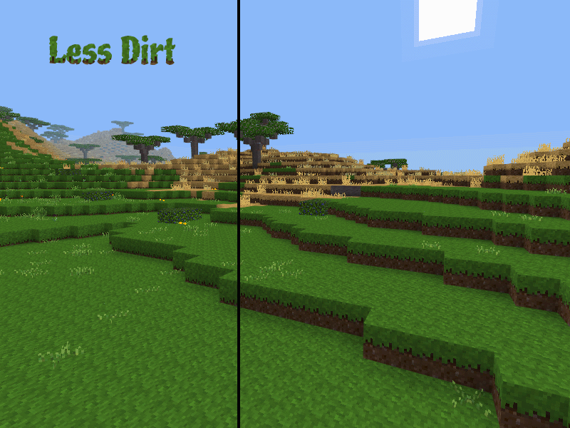

# Less Dirt texturepack for Minetest

Extends the grass growth on the side of blocks so rolling hills show less exposed bare dirt. Also does the same for snow, forest litter, moss, etc. This improves screenshots in a similar fashion to [Landscape redo](https://forum.minetest.net/viewtopic.php?t=20032) but doesn't alter nodes.

Removes a piece of Minecraft's legacy that Notch might not have gotten right. 

Works with:
* Minetest Game
* MineClone 2
* Ethereal
* Pull requests adding support for more games are welcome. Just remember to include attributions in LICENCE.txt in the pull request.

**Forum:** [Link](https://forum.minetest.net/viewtopic.php?t=23753)

